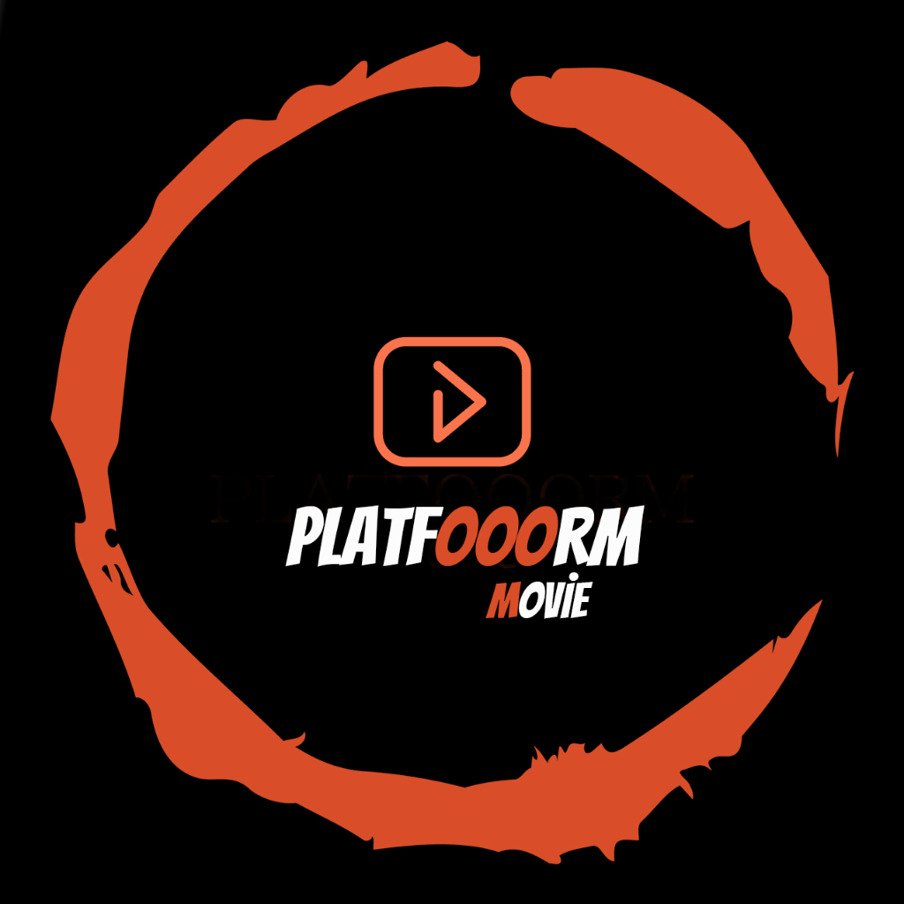

<div align="center">
  

  # Platfooorm Movie — Deep Links

  **GitHub Pages-hosted landing pages and Android App Links verification**

  [](https://play.google.com/store/apps/details?id=com.ckapps.test5)
</div>

---

## Yapı

- `docs/film/index.html` — Dinamik film landing page (TMDB-powered, çoklu dil, deep link)
- `docs/index.html` — Ana sayfa
- `docs/.well-known/assetlinks.json` — Android App Links doğrulama dosyası
- `docs/icon.png` — Uygulama ikonu

## URL Formatı

```
https://developer262391-lang.github.io/Platfooorm-Movie/film/?tmdbId={id}
https://developer262391-lang.github.io/Platfooorm-Movie/film/?tmdbId={id}&mediaType=tv
https://developer262391-lang.github.io/Platfooorm-Movie/film/?id={id}&type=2
https://developer262391-lang.github.io/Platfooorm-Movie/film/?tmdbId={id}&ref=tiktok
```

### Parametreler

| Param | Değerler | Anlamı |
|---|---|---|
| `tmdbId` | sayı | TMDB film/dizi ID'si |
| `id` | sayı | Backend film ID'si |
| `type` | `1` veya `2` | 1=normal, 2=adult |
| `mediaType` | `movie` veya `tv` | TMDB media type |
| `ref` | string | Pazarlama kanalı takip etiketi |

## Nasıl Çalışır

1. **Kullanıcı linke tıklar** (TikTok, WhatsApp, Telegram, vb.)
2. **App yüklüyse**: Android App Links anında uygulamayı açar, film sayfasına gider
3. **App yüklü değilse**: Tarayıcı landing'i açar — TMDB'den poster + film bilgileri + Play Store butonu
4. **ID bulunamazsa**: Trend filmler grid'i gösterilir (keşif modu)

## Lisans

Tüm hakları PlatfooormMovie tarafından saklıdır.
